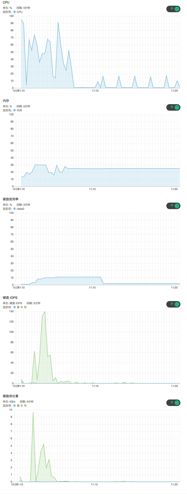

## 集群性能监控

### 概述

HashData 数据仓库提供了两大类与集群运行状态相关的信息：（1）活跃会话、运行查询等用户级别的信息；（2）节点（包括主节点和计算节点）的资源使用情况。用户级别的信息，您可以通过查看数据库活动情况中的系统视图获取。在这一章节中，我们重点看看如何获得节点级别的信息。通过分析这两类数据，您可以判断系统的性能瓶颈在哪个环节，以及数据仓库集群的类型和大小是否与工作负载相匹配，从而决定是否需要进行横向和纵向的扩缩容。

### 性能数据概要

目前， HashData 数据仓库提供三类节点物理资源监控数据：

* CPU使用率
* 内存使用率
* 硬盘使用率

#### 节点物理资源监控数据

在数据仓库主控制页面，选择您需要感兴趣的数据仓库集群；进入集群详情页面后，选择需要监控的节点：

打开“主机监控”开关，您就能看到节点的物理资源监控数据：

