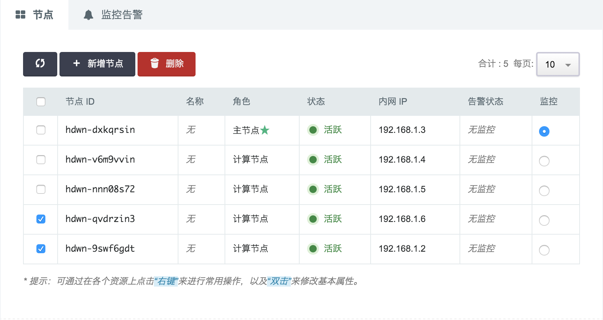

## 扩容和缩容

### 概述

随着您的数据仓库容量和性能需求的变化或增长，您可以通过调整集群的规模，以最优的方式利用 HashData 数据仓库提供的计算和存储资源。您可以通过改变集群的节点数量来扩展或收缩。或者，您还可以选择不同的节点来行来加强或减弱节点的能力。

您可以在集群的详细信息中，添加或删除节点。增加节点和删除节点时，数据将会导入到新的集群中。

### 横向扩容缩容

在您需要调整节点数量时，扩容和缩容操作是最便捷的方案。在调整集群节点数量时，您的数据将会从源集群的 segment-node 直接拷贝到目标集群的 segment-node。扩容或缩容的时间开销取决于数据总量以及两个集群的最小节点数量。根据数据量的不同，时间可能是从几小时到几天。

当您启动扩容或缩容操作时， HashData 数据仓库会将源集群置入只读模式，直到节点调整完毕。在这个过程中，您只能运行读取数据库的查询；您不能运行任何向数据库写入的查询。

在 HashData 数据仓库将源集群置入只读模式后，会根据您的集群节点类型和新的节点数量，立即创建一个新的集群，也就是目标集群。然后 HashData 数据仓库从源集群开始将数据拷贝到目标集群。当前面的操作完成后，所有的新客户连接将会转到目标集群。如果您的查询正在运行，您的连接将会中断，您必须重新在目标集群上运行该查询。

要了解  HashData 数据仓库集群的扩容或缩容教程，请参考：`横向扩容缩容教程`。

### 横向扩容缩容教程

**扩容**：

1. 在数据仓库汇总页面，点击要进行扩容的集群进入集群详细信息页面：  
   

2. 点击 **增加节点** 按钮，填写要增加的节点数量，并点击继续：  
   

   **节点数量**：填写要增加的节点数量。

3. 数据仓库在进行扩容时，将会创建一个新的集群，并将数据拷贝到新的集群。您可以在集群详细信息中，看到集群的状态：  
   

4. 扩容结束后，新集群将会替代旧集群。旧集群将会进入废弃状态：  
   

**缩容**：

1. 在数据仓库汇总页面，点击要进行缩容的集群进入集群详细信息页面：  
   

2. 在集群详细信息页面，勾选需要删除的节点，然后点击 **删除** 按钮：  
   

3. 数据仓库在进行缩容时，将会创建一个新的集群，并将数据拷贝到新的集群。您可以在集群详细信息中，看到集群的状态：  
   

4. 缩容结束后，新集群将会替代旧集群。旧集群将会进入废弃状态：  
   

## 排查系统问题

如果您在使用  HashData 数据仓库 过程中遇到任何问题，欢迎通过应用页中（下图所示）的“创建工单”联系我们。  


同时， HashData 数据仓库 作为一个自服务的 PaaS 产品，提供多种系统信息，让您能够自己排查系统问题，加快问题解决速度。

### 查看数据库活动情况

您可以从以下三方面检查数据库状态：

* 活跃的会话（工作负载）
* 锁（竞争）
* 系统资源使用

#### 检查活跃的会话

系统视图 _pg\_stat\_activity _提供活跃会话的信息，每行记录对应一个活跃的会话。这些信息包括数据库的 OID，数据库名字，服务器进程的 PID，用户的 OID，用户名字，当前的查询语句，当前查询开始时间，当前服务器进程启动时间，客户端地址，和端口号。为了获取关于当前工作负载最详细的信息，建议您以超级用户的角色去查询这个系统视图。例如：

```
=>SELECT * FROM pg_stat_activity;
```

> 注意：这些信息不是实时更新的。

#### 检查锁

系统视图 _pg\_locks _允许您查看关于正在使用中的锁的信息。如果一个事务拿着一把对应某个对象的锁，那么其它所有需要访问那个对象的查询必须等待这把锁被释放后才能继续往前执行。从用户的角度看，这种现象就像查询被挂起了。

通过检查那些还没被授予的锁，我们能够对不同数据库客户端会话之间的竞争情况有所了解。pg\_locks 提供了这个数据库系统全局的锁信息，而不仅仅局限于当前数据库。您可以将锁信息与表（仅限于当前数据库中的表）进行关联，从而了解哪些表正处于竞争状态；您也可以锁信息与 _pg\_stat\_activity_ 进行关联，从而了解哪些客户端会话拿着锁或者正在等待锁。例如：

```
=> SELECT locktype, database, c.relname, l.relation,
   l.transactionid, l.transaction, l.pid, l.mode, l.granted,
   a.current_query
   FROM pg_locks l, pg_class c, pg_stat_activity a
   WHERE l.relation=c.oid AND l.pid=a.procpid
   ORDER BY c.relname;
```

#### 检查系统资源使用

您可以通过上面提到的 节点物理资源监控数据来检查系统资源使用情况，包括CPU，内存，磁盘I/O和网络I/O，从而判断当前系统的性能瓶颈，如当前查询是计算密集型的还是I/O密集型的。

### 取消或中断后台操作

有些情况下，您之前提交的查询运行了很长时间还没有结束，于是想把查询取消了。除了可以通过在客户端发取消信号（如CTRL＋C）外，您还可以通过内置信号函数给服务器后台进程发送取消或者中断信号，从而将查询取消。通过检查活跃的会话我们可以得到查询对应的后台进程 PID，然后通过 pg\_cancel\_backend\(pid int\) 和 pg\_terminate\_backend\(pid int\) 给 pid 对应的后台进程发送 SIGINT 或者 SIGTERM 信号，从而取消或者中断相应的查询。
