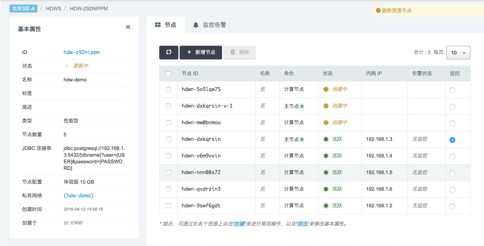

# 扩容和缩容

## 概述

随着您的数据仓库容量和性能需求的变化或增长，您可以通过调整集群的规模，以最优的方式利用 HashData 数据仓库提供的计算和存储资源。您可以通过改变集群的节点数量来扩展或收缩。或者，您还可以选择不同的节点来行来加强或减弱节点的能力。

您可以在集群的详细信息中，添加或删除节点。增加节点和删除节点时，数据将会导入到新的集群中。

## 横向扩容缩容

在您需要调整节点数量时，扩容和缩容操作是最便捷的方案。在调整集群节点数量时，您的数据将会从源集群的 segment-node 直接拷贝到目标集群的 segment-node。扩容或缩容的时间开销取决于数据总量以及两个集群的最小节点数量。根据数据量的不同，时间可能是从几小时到几天。

当您启动扩容或缩容操作时， HashData 数据仓库会将源集群置入只读模式，直到节点调整完毕。在这个过程中，您只能运行读取数据库的查询；您不能运行任何向数据库写入的查询。

在 HashData 数据仓库将源集群置入只读模式后，会根据您的集群节点类型和新的节点数量，立即创建一个新的集群，也就是目标集群。然后 HashData 数据仓库从源集群开始将数据拷贝到目标集群。当前面的操作完成后，所有的新客户连接将会转到目标集群。如果您的查询正在运行，您的连接将会中断，您必须重新在目标集群上运行该查询。

要了解  HashData 数据仓库集群的扩容或缩容教程，请参考：`横向扩容缩容教程`。

## 横向扩容缩容教程

**扩容**：

1. 在数据仓库汇总页面，点击要进行扩容的集群进入集群详细信息页面：  
   

2. 点击 **增加节点** 按钮，填写要增加的节点数量，并点击继续：  
   

   **节点数量**：填写要增加的节点数量。

3. 数据仓库在进行扩容时，将会创建一个新的集群，并将数据拷贝到新的集群。您可以在集群详细信息中，看到集群的状态：  
   

4. 扩容结束后，新集群将会替代旧集群。旧集群将会进入废弃状态：  
   

**缩容**：

1. 在数据仓库汇总页面，点击要进行缩容的集群进入集群详细信息页面：  
   

2. 在集群详细信息页面，勾选需要删除的节点，然后点击 **删除** 按钮：  
   

3. 数据仓库在进行缩容时，将会创建一个新的集群，并将数据拷贝到新的集群。您可以在集群详细信息中，看到集群的状态：  
   

4. 缩容结束后，新集群将会替代旧集群。旧集群将会进入废弃状态：  
   

