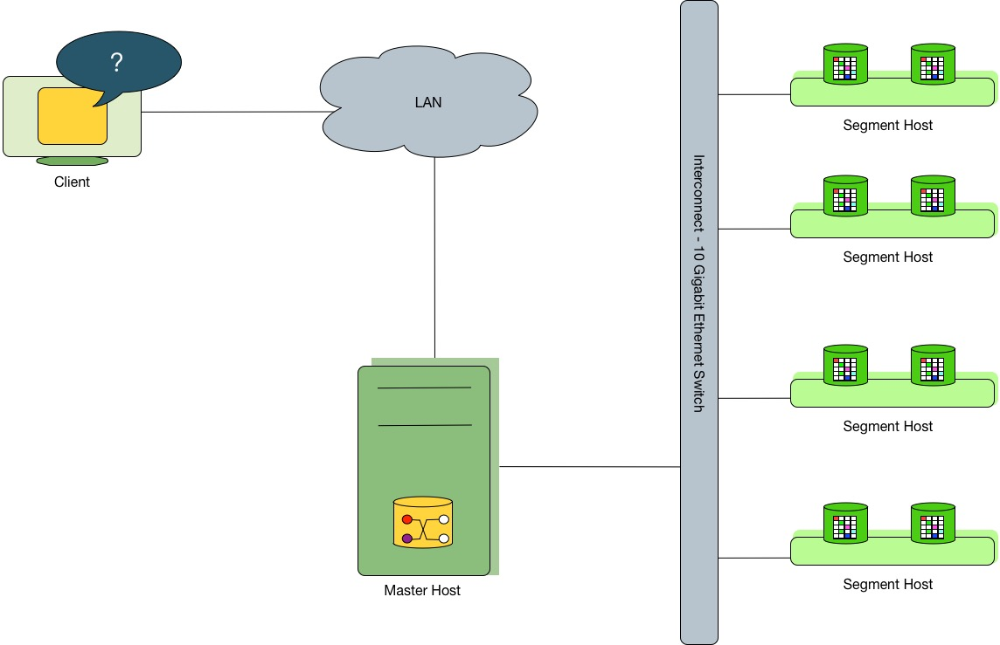

# HashData 数据仓库系统概述

本章节将会介绍 HashData 数据仓库的模块及一些关键特性，让您对本产品拥有更加深刻的认识和理解。

本章节涵盖以下内容:

* [*HashData 数据仓库架构*](#2)

## <h2 id='2'> HashData 数据仓库架构

HashData 数据仓库是为了管理大容量分析型数据仓库和商业智能分析业务而设计的大规模并行处理（MPP）数据库服务系统。

MPP（也被称作 shared nothing 架构）是指一个系统拥有两个或者两个以上的处理器，相互合作来执行任务。每个处理器都配有独立的内存，操作系统和磁盘。HashData 数据仓库采用高性能的系统架构可以将请求均匀分散到存储 TB 级别的数据仓库上，同时充分利用系统中所有的资源，并行的处理请求。

HashData 数据仓库是基于 greenplum 和 postgres 开源数据库技术，通过对 postgres 的修改，得到的并行架构数据库。从系统信息表，优化器，查询执行器，事务管理等各个方面都进行了修改和增强，来满足真正将查询从内部并行运行在多个计算节点上。通过快速的内部软件数据交互模块，满足系统在多个节点间数据的传输和处理要求，使得整个系统在外面看就像是一个计算能力等于上百台机器的单一数据库系统。

HashData 数据仓库的 master 节点是整个数据库系统的入口节点，用户通过客户端连接 master 节点来提交 SQL 查询语句。master 节点将会协调其它 segment 节点来存储和处理用户的数据。

##### 图1. 系统架构

### master 节点

HashData 数据仓库的 master 节点是整个数据库系统的入口，用来接受客户端连接，接收 SQL  
查询，并将作业分发到 Segment 节点上执行。

HashData 数据仓库的用户可以像使用 postgres 一样，通过 master 节点来访问 HashData 数据仓库系统。目前支持客户端程序 psql 或应用编程接口 ODBC 或 JDBC。

master 节点存储了描述系统全局结构的系统信息表（global system catalog），这些信息表中存储了 HashData 数据仓库自己的元信息（metadata）。master 节点没有存储用户数据的信息，所有的用户数据都存储在 Segment 节点，master 节点认证客户端连接，处理客户提交的 SQL 命令，将查询分发到存储数据的 Segment 节点，协调各个 Segment 节点执行，并汇总执行结果，最后返回给客户端程序。

### Segment 节点

HashData 数据仓库的 Segment 节点实际上同样是一个经过修改的 postgres 数据库，每个 Segment 节点都存储了一部分用户数据，并主要负责执行用户的查询。

每当用户连接到 master 节点，并且发送一个查询时，每个 Segment 节点都会创建一些进程来共同处理改查询。要了解更多关于查询的处理过程，请参考 [查询数据]()。

用户定义的数据表和相应的索引将会自动被分散到 HashData 数据仓库的节点上，每个 Segment 节点  
上都存储了一部分用户数据，并且这些数据是不相交的。

### 软件数据交换模块

软件数据交换模块是 HashData 数据仓库架构中的网络层。此模块负责处理 Segment 节点之间和网络之间的进程间通信。此模块默认使用经过深度调优的带流量控制的 UDP 协议来传输数据。这种算法除了提供 TCP 协议支持的可靠性外，在性能和水平扩展能力都优于 TCP 协议。

