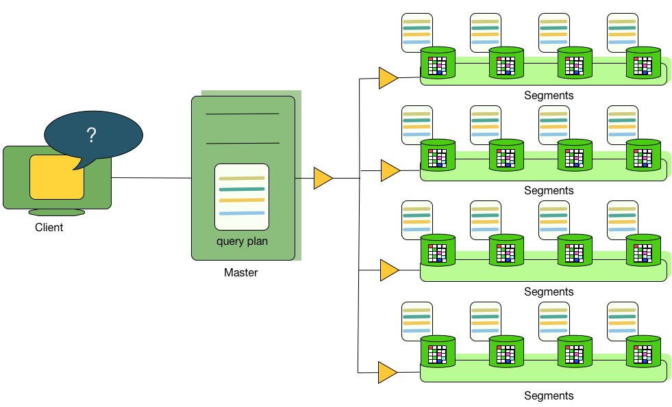
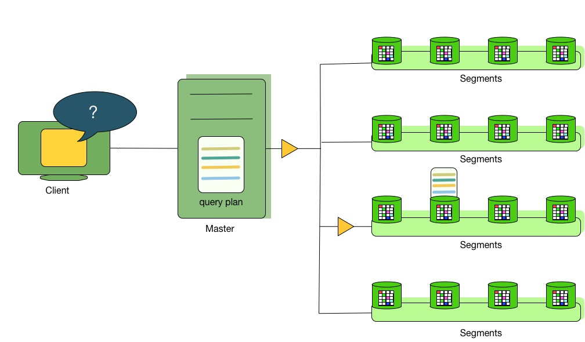
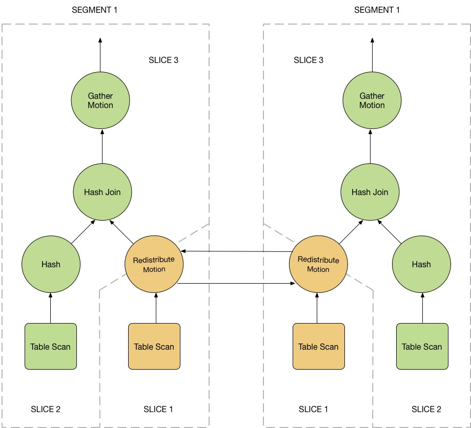
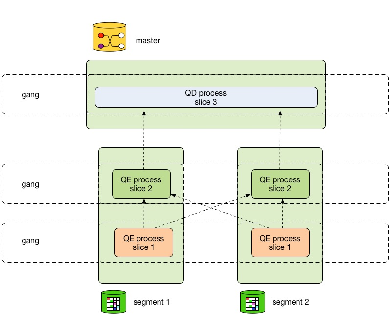

# 查询数据

本章节向您介绍使用 SQL 的相关信息。

您可以通过交互式 SQL 客户端（例如：psql）或者其他客户端工具向指定数据库输入 SQL 语言，来查阅，修改和进行数据分析。

* 数据处理简介
* 查询的定义
* 使用函数和运算符

## 数据处理简介

本主题为您介绍 HashData 数据仓库是如何处理查询请求的。理解查询处理的过程，对您编写和优化查询有非常巨大的帮助。

用户向 HashData 数据仓库发送查询命令和使用其它数据库管理系统完全一样。 通过使用客户端应用程序（例如：psql）连接 HashData 数据仓库主节点，您可以提供 SQL 语句命令。

### 理解查询优化和查询分发

主节点负责接收，分析和优化用户查询。最终的执行计划可以是完全并行的，也可以是运行在特定节点的。 如 [图1]() 对于并行查询计划，主节点将其发送到所有的计算节点上。如 [图2]() 所示， 对于运行在特定节点的执行计划，主节点将会发送查询计划到一个单独的节点运行。 每个计算节点只负责在自己对应的数据上进行相应的数据操作。

大多数的数据库操作是在所有计算节点并行进行的，例如：扫描数据表，连接运算，聚合运算和排序操作。 每个计算节点的操作都不依赖存储在其它计算节点上的数据。




##### 图1：分发并行查询计划

一些查询可能只访问特定计算节点的数据，例如：单行插入，更新，删除或者是查询操作只涉及表中特定数据 （过滤条件正好是表的数据分布键值）。对于上述的查询，查询计划不会发送给所有的计算节点， 而是将查询计划发送给该查询影响的节点。


##### 图2：分发特定节点查询计划

### 理解查询计划

查询计划就是 HashData 数据仓库为了计算查询结果的一系列操作的步骤。查询计划中的每个步骤（节点）代表了一种数据库操作，例如：表扫描，连接运算，聚合运算或者排序操作。查询计划的读取和执行都是自底向上的。

除了常见的操作外，HashData 数据仓库还支持一些特殊的操作：motion 节点（移动）。移动节点就是查询处理过程中，在不同计算节点直接移动数据。需要注意的是，不是所有的查询都需要数据移动的。例如：运行在特定节点的查询是不需要任何数据移动的。

为了能让查询执行获得最大的并行粒度，HashData 数据仓库通过将查询计划进行切片来进一步分解任务。每个切片都是可以被一个计算节点独立执行的查询计划子集。当查询计划中包含了数据移动节点时，查询计划就是被分片的。数据移动节点的上下两部分各自是一个独立的分片。

让我们来看下面这个例子：这是一个简单的两张表连接的运算：

```
SELECT customer, amount
FROM sales JOIN customer USING (cust_id)
WHERE dateCol = '04-30-2008';
```
[图3]() 展示了上面查询的查询计划。每个计算节点都会收到一份查询计划的拷贝，并且并行进行处理。

这个示例的查询计划包含了一个数据重分布的数据移动节点，该节点用来在不同计算节点直接移动记录使得连接运算得意完成。这里之所有需要数据重分布的节点，是因为 customer 表（用户表）的数据分布是通过 cust_id 来进行的，而 sales 表（销售表）是根据 sale_id 进行的。为了进行连接操作，sales 表的数据需要重新根据 cust_id 来分布。因此查询计划在数据重分布节点两侧被切片，分别是 slice 1 和 slice 2。

这个查询计划还包括了另一种数据移动节点：数据聚合节点。数据聚合节点是为了让所有的计算节点将结果发送给主节点，最后从主节点发送给用户引入的。由于查询计划总是在数据移动节点出现时被切片，这个查询计划还包括了一个隐藏的切片，该切片位于查询的最顶层（slice3）。并不是所有的查询都包含数据聚合移动节点，例如：

```
CREATE TABLE x AS
SELECT ...
```
语句不需要使用数据聚合移动节点，这是因为数据将会移动到新创建的数据表中，而非主节点。


##### 图3：查询计划切片

### 理解并行查询计划的执行
HashData 数据仓库将会创建多个数据库进程来处理查询的相关工作。在主节点上，查询工作进程被称为查询分派器（QD）。QD 负责创建和分派查询计划。它同时负责收集和展示最终查询结果。 在计算节点上，查询工作进程被称作查询执行器（QE）。QE 负责执行分配给该进程的查询计划并通过通信模块将中间结果发送给其它工作进程。

每个查询计划的切片都至少会有一个工作进程与之对应负责执行。工作进程会被赋予不会互相依赖的查询计划片段。查询执行的过程中，每个计算节点都会有多个进程并行地参与查询的处理工作。

在不同计算节点上执行相同切片查询计划的工作进程被称为进程组。随着一部分工作的完成，数据记录将会从一个进程组流向其它进程组。这种在数据节点之间的进程间通信被称为互联组件。

[图4]() 向您展示对于 [图3]() 中查询计划在主节点和两个计算节点上的进程分布情况。


##### 图4：查询执行器处理请求

## 查询的定义
HashData 数据仓库查询命令是基于 PostgreSQL 开发，而 PostgreSQL 是实现了 SQL 标准。

本小结介绍如何在 HashData 数据仓库中编写 SQL 查询。

* SQL 词法元素
* SQL 值表达式

### SQL 词法元素

SQL 是一种标准化的数据库访问语言。不同元素组构成的语言允许控制数据存储，数据获取，数据分析， 数据变换和数据修改等。你需要通过使用 SQL 命令来编写 HashData 数据仓库理解的查询和命令。SQL 查询由一条或多条命令顺序组成。每一条命令是由多个词法元素组成正确的语法结构构成的， 每条命令使用分号（;）分隔。

HashData 数据仓库在 PostgreSQL 的语法结构上进行了一些扩展，并根据分布式环境增加了部分的限制。如果您希望了解更多关于 PostgreSQL 中的 SQL 语法规则和概念，您可以参考 PostgreSQL8.2英文手册中SQL语法章节 或者 PostgreSQL9.3中文手册中 SQL 语法章节。由于中文网站没有 8.2 手册，请您注意相关资料中的语法变动。

### SQL 值表达式

SQL 值表达式由一个或多个值，符号，运算符，SQL 函数和数据组成。表达式通过比较数据，执行计算病返回一个结果。表达式计算包括：逻辑运算，算数运算和集合运算。

下面列出值表达式的类别：

* 聚合表达式
* 数组构造表达式
* 列引用
* 常亮或字面值
* 相关自查询
* 成员选择表达式
* 函数调用
* INSERT 或 UPDATE 语句中，为列提供的值
* 运算符调用
* 列引用
* 在函数体内或 Prepared 语句中引用位置参数
* 记录构造表达式
* 标量子查询
* WHERE 子句中的搜索条件
* SELECT 语句中的返回列表
* 类型转换
* 括号保护的子表达式
* 窗口表达式

像函数和运算符这样的 SQL 结构虽然属于表达式，但是与普通的语法规则不相同。请参考使用函数和运算符了解更多信息。

#### 列引用
列引用的格式如下：

```
correlation.columnname
```
上面的示例中，correlation 是表的名称（也可以使用限定名格式：在表名前面添加模式名）或者定义在 FROM 子句中的表的别名。如果列名在查询访问的表中是唯一的，那么 “correlation.” 部分是可以被省略的。

#### 位置参数

位置参数是指通过指定传递给 SQL 语句或函数参数的位置信息来引用的参数。例如：`$1` 引用第一个参数，`$2` 引用第二个参数，依此类推。位置参数的值是通过在 SQL 语句的外部参数传递或者通过函数调用方式传递。 一些客户端接口库函数支持在 SQL 命令之外指定数值，在这种情况下参数引用的是 SQL 之外的实际值。

引用位置参数的格式如下：

```
$number
```
示例:

```
CREATE FUNCTION dept(text) RETURNS dept
    AS $$ SELECT * FROM dept WHERE name = $1 $$
    LANGUAGE SQL;
```
这里, `$1` 引用的是在函数调用时，传递给函数的第一个参数值。

#### 下标表达式

如果一个表达式产生了一个数组类型值，那么你可以通过下面的方法获取数组中一个指定的元素值：

```
expression[subscript]
```
您还可以获取多个相连的元素值，称为数组分片，示例如下：

```
expression[lower_subscript:upper_subscript]
```
下标可以是一个表达式，该表达式必须返回整数值类型。

大部分时候，数组表达式必须在括号中使用。如果下标表达式访问列引用或者位置参数，括号是可以省略的。 对于多维数组，可以直接连接多个下标表达式来进行访问，示例如下：

```
mytable.arraycolumn[4]
mytable.two_d_column[17][34]
$1[10:42]
(arrayfunction(a,b))[42]
```
#### 成员选择表达式
如果表达式的值是一个复合类型（例如：记录类型），你可以通过下面的表达式来选择该复合类型中的特定成员值：

```
expression.fieldname
```
记录表达式通常需要在括号中使用，如果被访问的表达式是表引用或者位置参数，括号是可以省略的。示例：

```
mytable.mycolumn
$1.somecolumn
(rowfunction(a,b)).col3
```
一个限定的列引用是成员选择表达式的特例。

#### 运算符调用
运算符调用支持下面的几种语法：

```
expression operator expression(binary infix operator)
operator expression(unary prefix operator)
expression operator(unary postfix operator)
```
示例中的 operator 实际是运算符符号，例如：AND，OR，+ 等。运算符也有限定名格式，例如：

```
OPERATOR(schema.operatorname)
```
可以使用的运算符以及他们究竟是一元运算符还是二元运算符，取决于系统和用户的定义。可以参考内建函数和运算符，了解更多信息。

#### 函数调用
函数调用的语法是函数名（限定名格式：在函数名开头添加模式名）跟随着使用括号保护的参数列表：

```
function ([expression [, expression ... ]])
```
下面示例是通过函数调用计算2的平方根：

```
sqrt(2)
```
参考内置函数和运算符，了解更多信息。

#### 聚集表达式
聚合表达式是指对于查询选择的所有数据记录上应用一个聚合函数。聚合函数在一组值上进行运算，并返回一个结果。例如：对一组值进行求和运算或者计算平均值。下面列出聚合表达式的语法结构：

* aggregate\_name(expression [ , … ] ) — 处理所有值为非空的输入记录值。
* aggregate\_name(ALL expression [ , … ] ) — 和上一个表达式行为一致，因为 ALL 是默认参数。
* aggregate\_name(DISTINCT expression [ , … ] ) — 处理所有去除重复后的非空输入记录值。
* aggregate\_name(\*) — 处理所有输入记录值，非空值和空值都会被处理。通常这个表达式都是为count(\*)服务的。

上面表达式中的 aggregate\_name 是一个预定义的聚合函数名称（可以使用模式限定名格式）。上面表达式中的 expression 可以是除聚合表达式自身外的任何值合法表达式。

例如，count(\*) 返回输入记录的总数量，count(f1) 返回 f1 值中非空的总数量，count(distinct f1) 返回的是 f1 值中非空并去除重复值后的总数量。

要了解预定义的聚合函数，请参考内置函数和运算符。除了预定义聚合函数外，您还可以创建自定义的聚合函数。

HashData 数据仓库提供 MEDIAN 聚合函数，该函数返回 PERCENTILE\_CONT 的 50 分位数结果。 下面是逆分布函数支持的特殊聚合表达式：

```
PERCENTILE_CONT(percentage) WITHIN GROUP (ORDER BY expression)
PERCENTILE_DISC(percentage) WITHIN GROUP (ORDER BY expression)
```
目前只有上面两个表达式可以使用关键字 WITHIN GROUP。

#### 聚合表达式的限制
下面列出了目前聚合表达式的限制：

HashData 数据仓库不支持下面关键字：ALL，DISTINCT，FILTER 和 OVER。请参考 [表5]() 了解更多信息。

聚合表达式只能出现在 SELECT 命令的结果列表或者 HAVING 子句中。在其它位置紧致访问聚合表达式，例如：WHERE。这是因为在其它其它位置的计算早于聚合数据的操作。此限制特指聚合表达式所属的查询层次。

当一个聚合表达式出现在子查询中，聚合操作相当于作用在子查询的返回结果上。如果聚合函数的参数只包含外层变量，该聚合表达式属于最近一层的外部表查询，并且也在该查询结 果上进行聚合运算。该聚合表达式对于出现的子查询来说，将会当成一个外部引用，并以常量值处理。请参考 [表2]() 了解标量子查询。

HashData 数据仓库不支持在多个输入表达式上使用 DISTINCT。

#### 窗口表达式

窗口表达式允许应用开发人员更加简单地通过标准SQL语言，来构建复杂的在线分析处理（OLAP）。 例如，通过使用窗口表达式，用户可以计算移动平均值，某个范围内的总和，根据某些列值的变化重置聚合表达式或排名，还可以用简单的表达式表述复杂的比例关系。

窗口表达式表示在窗口帧上应用窗口函数，窗口帧是通过非常特别的 OVER() 子句定义的。窗口分区是分组后的应用于窗口函数的记录集合。与聚合函数针对每个分组的记录返回一个结果不同，窗口函数真对每行都返回结果，但是该值的计算是完全真对根据记录对应的窗口分区进行的。如果不指定分区，窗口函数就会在整个结果集赏进行计算。

窗口表达式的语法如下：

```
window_function ( [expression [, ...]] ) OVER ( window_specification )
```
这里的 window\_function 是表 3 列出的函数之一，表达式是任何不包含窗口表达式的合法值。window\_specification 定义如下：

```
[window_name]
[PARTITION BY expression [, ...]]
[[ORDER BY expression [ASC | DESC | USING operator] [, ...]
    [{RANGE | ROWS}
       { UNBOUNDED PRECEDING
       | expression PRECEDING
       | CURRENT ROW
       | BETWEEN window_frame_bound AND window_frame_bound }]]
```
上面的 window\_frame\_bound 定义如下:

```
UNBOUNDED PRECEDING
expression PRECEDING
CURRENT ROW
expression FOLLOWING
UNBOUNDED FOLLOWING
```
窗口表达式只能在 SELECT 的返回里表中出现。例如：

```
SELECT count(*) OVER(PARTITION BY customer_id), * FROM sales;
```
OVER 子句是窗口函数与其他聚合函数或报表函数最大的区别。OVER 子句定义的 window\_specification 确定了窗口函数应用的范围。窗口说明包含下面特征：

PARTITION BY 子句定义应用于窗口函数上的窗口分区。如果省略此参数，整个结果集将会作为一个分区使用。

ORDER BY 子句定义在窗口分区中用于排序的表达式。窗口说明中的 ORDER BY 子句和主查询中的 ORDER BY 子句是相互独立的。ORDER BY 子句对于计算排名的窗口函数来说是必需的，这是因为排序后才能获得排名值。 对于在线分析处理聚合操作，窗口帧（ROWS 或 RANGE 子句）需要 ORDER BY 子句才能使用。
ROWS/RANGE 子句为聚合窗口函数（非排名操作）定义一个窗口帧。窗口帧是在一个分区内的一组记录。 定义了窗口帧之后，窗口函数将会在移动窗口帧上进行计算，而不是固定的在整个窗口分区上进行。 窗口帧可以是基于记录分隔的也可以是基于值分隔的。
#### 类型转换
类型转换表达式可以将一个数据类型的数据转换为另一个数据类型。HashData 数据仓库支持下面两种等价的类型转换语法：

```
CAST ( expression AS type )
expression::type
```
CAST 的语法是符合 SQL 标准的的；而语法 :: 是 PostgreSQL 历史遗留的习惯。

对于已知类型值表达式的类型转换操作是运行时类型转换。只有当系统中适用的类型转换函数，类型转换才可能成功。 这与直接在常量上应用类型转换并不相同。在字符串字面值上应用的类型转换代表了用字面值常量对一个类型进行初始赋值。 因此，该字符串字面值只要是该类型接收的合法输入，该类型转换都会成功。

在一些位置上，表达式的值类型如果不会产生歧义时，显示类型转换是可以被省略的。 例如，当为一张表的某个列赋值时，系统能够自动应用正确的类型转换。 系统要应用自动类型转换规则的前提是，当且仅当系统表中定义隐式地类型转换是合法的。 其他的类型转换，必需通过类型转换语法显示地进行调用。这样做可以阻止一部分用户意料之外的非期望类型转换的发生。

#### 标量子查询
标量子查询是指一个括号中的 SELECT 查询语句，并且该语句返回值是一行一列（一个值）。标量子查询不支持使用返回多行或多列的 SELECT 查询语句。外部查询运行并使用相关自查询的返回结果。相关标量子查询是指标量子查询中引用了外部查询变量的查询。

#### 相关子查询
相关子查询是指一个 SELECT 查询位于 返回列表或 WHERE 条件语句中，并引用了外部查询参数的查询语句。相关子查询允许更高效的表示出引用其他查询的返回结果。HashData 数据仓库能够支持相关子查询特性，此特性能够允许兼容很多已经存在的应用程序。 相关子查询可以根据返回记录是一条还是多条，返回结果可以是标量或者表表达式， 这取决于它返回的记录是一条还是多条。HashData 数据仓库目前不支持引用跨层的变量（不支持间接相关子查询）。

相关子查询示例 

***示例 1 – 标量相关子查询***

```
SELECT * FROM t1 WHERE t1.x
            > (SELECT MAX(t2.x) FROM t2 WHERE t2.y = t1.y);
```
***示例 2 – 相关 EXISTS 子查询***

```
SELECT * FROM t1 WHERE
EXISTS (SELECT 1 FROM t2 WHERE t2.x = t1.x);
```
HashData 数据仓库利用下面两个算法来运行相关子查询：

将相关子查询展开成为连接运算：这种算是是最高效的方法，这也是 HashData 数据仓库对于大部分相关子查询使用的方法。一些 TPC-H 测试集中的查询都可以通过此方法进行优化。
对于引用的查询的每一条记录，都执行一次相关子查询：这是一种相对来说低效的算法。HashData 数据仓库对于位于 SELECT 返回列表中的相关子查和 WHERE 条件中 OR 连接表达式中的相关子查询使用这种算法。

下面的例子，向您展示对于不同类型的查询，如何通过查询重写来改进性能。

***示例 3 - Select 返回列表中的相关子查询***

原始查询

```
SELECT T1.a,
      (SELECT COUNT(DISTINCT T2.z) FROM t2 WHERE t1.x = t2.y) dt2
FROM t1;
```
重写后的查询首先与表 t1 执行内连接，再执行左外连接。查询重写只能对等值连接中的相关条件进行处理。

重写后的查询

```
SELECT t1.a, dt2 FROM t1
       LEFT JOIN
        (SELECT t2.y AS csq_y, COUNT(DISTINCT t2.z) AS dt2
              FROM t1, t2 WHERE t1.x = t2.y
              GROUP BY t1.x)
       ON (t1.x = csq_y);
```
***示例 4 - OR 子句中的相关子查询 原始查询***

```
SELECT * FROM t1
WHERE
x > (SELECT COUNT(*) FROM t2 WHERE t1.x = t2.x)
OR x < (SELECT COUNT(*) FROM t3 WHERE t1.y = t3.y)
```
重写后的查询是根据 OR 条件，将原来查询分成两个部分，并使用 UNION 进行连接。

重写后的查询

```
SELECT * FROM t1
WHERE x > (SELECT count(*) FROM t2 WHERE t1.x = t2.x)
UNION
SELECT * FROM t1
WHERE x < (SELECT count(*) FROM t3 WHERE t1.y = t3.y)
```
要查看查询计划，可以使用 EXPLAIN SELECT 或者 EXPLAIN ANALYZE SELECT。查询计划中的 Subplan 节点代表查询将会对外部查询的每一条记录都处理一次，因此暗示着查询可能可以被重写和优化。

#### 高级“表”表达式
HashData 数据仓库支持能够将“表”表达式作为参数的函数。您可以对输入高级“表”函数的记录使用 ORDER BY 进行排序。您可以使用 SCATTER BY 子句并指定一列或多列（或表达式）对输入记录进行重新分布。这种使用方式与创建表的时候，DISTRIBUTED BY 子句十分类似，但是此处重新分布的操作是在查询运行时发生的。

>注意：根据数据的分布，HashData 数据仓库能够自动地在计算节点并行的运行 “表” 表达式。

#### 数组构造表达式
数据构造表达式是通过提供成员值的方式构造数组值的表达式。一个简单的数组构造表达式由：关键字 ARRAY，左方括号（[），用来组成数组元素值的通过逗号分隔的一个多个表达式，和一个右方括号（]）。例如：

```
SELECT ARRAY[1,2,3+4];
  array
---------
 {1,2,7}
```
数组元素的类型就是其成员表达式的公共类型，确定的方式和 UNION，CASE 构造器规则相同。

通过嵌套数组构造表达式，您还可以创建多维数组值。内部的数组构造器，可以省略关键字 ARRAY。例如，下面两个 SELECT 语句返回的结果完全相同：

```
SELECT ARRAY[ARRAY[1,2], ARRAY[3,4]];
SELECT ARRAY[[1,2],[3,4]];
     array
---------------
 {{1,2},{3,4}}
```
由于多维数组一定是矩形（长方形），在同一层的内部构造表达式产生的子数组必须拥有相同的维度。

多维数组构造表达器中的元素不一定是子数组构造表达式，它们可以是任何一个产生适当类型数组的表达式。例如：

```
CREATE TABLE arr(f1 int[], f2 int[]);
INSERT INTO arr VALUES (ARRAY[[1,2],[3,4]],
ARRAY[[5,6],[7,8]]);
SELECT ARRAY[f1, f2, '{{9,10},{11,12}}'::int[]] FROM arr;
                     array
------------------------------------------------
 {{{1,2},{3,4}},{{5,6},{7,8}},{{9,10},{11,12}}}
```
你可以使用子查询的结果来构造数组。这里的数组构造表达式是关键字 ARRAY 开头，后面跟着在圆括号中的子查询。例如：

```
SELECT ARRAY(SELECT oid FROM pg_proc WHERE proname LIKE 'bytea%');
                          ?column?
-----------------------------------------------------------
 {2011,1954,1948,1952,1951,1244,1950,2005,1949,1953,2006,31}
```
这里的子查询只能返回单列。生成的一维数组中的每个元素对应着子查询每一条记录，数组元素的类型是子查询输出列的类型。通过数组构造表达式得到的数组，下标总是从 1 开始编号。

#### 记录构造表达式
记录构造器是一种用来从成员值构建记录值的表达式（记录表达式也被称为复合类型）。例如：

```
SELECT ROW(1,2.5,'this is a test');
```
记录构造表达式还支持语法 rowvalue.\* ，该表达式能够将记录值的成员展开成列表，这个操作类似于当你在 SELECT 目标列表时使用的 .\* 语法。例如，如果表 t 有两列 f1 和 f2，下面的查询是等价的：

```
SELECT ROW(t.*, 42) FROM t;
SELECT ROW(t.f1, t.f2, 42) FROM t;
```
记录构造表达式默认创建的记录值具有匿名记录类型。根据需要，您可以将该值通过类型转换表达式，转换成一个命名复合类型：数据表的记录类型或者是通过 CREATE TYPE AS 命令创建的复合类型。您可以显示地提供类型转来避免出现歧义。例如：

```
CREATE TABLE mytable(f1 int, f2 float, f3 text);
CREATE FUNCTION getf1(mytable) RETURNS int AS 'SELECT $1.f1'
LANGUAGE SQL;
```
下面的查询语句中，因为全局只有一个 getf1() 函数，所以这里不产生任何的歧义，您也就不需要进行类型转换的处理：

```
SELECT getf1(ROW(1,2.5,'this is a test'));
 getf1
-------
     1
CREATE TYPE myrowtype AS (f1 int, f2 text, f3 numeric);
CREATE FUNCTION getf1(myrowtype) RETURNS int AS 'SELECT
$1.f1' LANGUAGE SQL;
```
下面的例子需要通过类型转换来指定具体调用的函数：

```
SELECT getf1(ROW(1,2.5,'this is a test'));
ERROR:  function getf1(record) is not unique
SELECT getf1(ROW(1,2.5,'this is a test')::mytable);
 getf1
-------
     1
SELECT getf1(CAST(ROW(11,'this is a test',2.5) AS
myrowtype));
 getf1
-------
    11
```
你可以使用记录构造器来构建复合值，将其存储在复合类型的列中或者将其传给接受复合类型参数的函数。

#### 表达式求值规则
自表达式的求值顺序是未定义的。运算符或者函数的求值不一定遵守从左到右的规则，也不保证按照任何特定顺序进行。

如果表达式的值能够由表达式中的一部分子表达式确定，那么其他部分的子表达式可能不会被求值。例如，下面的表达式：

```
SELECT true OR somefunc();
```
somefunc() 函数可能不会被调用。类似的情况对下面例子也适用：

```
SELECT somefunc() OR true;
```
这个特点和大多数编程语言中，布尔运算符求值顺序总是从左到右不太一样。

不要在复杂表达式中使用带有副作用的函数，特别是像 WHERE 或者 HAVING 子句。因为这里语句在生成查询计划过程中会被多次处理。在上面语句中的布尔表达式（AND/OR/NOT 组合）将会根据布尔代数规则重新排列成为任何最优合法结构。

您可以使用 CASE 结构来保证求值顺序。下面的示例就是一个不能保证避免除0错误的情况：

```
SELECT ... WHERE x <> 0 AND y/x > 1.5;
```
下面的示例能够保证避免除0错误：

```
SELECT ... WHERE CASE WHEN x <> 0 THEN y/x > 1.5 ELSE false END;
```
这种 CASE 结构将会阻止查询优化，因此请小心使用。

## 使用函数和运算符
HashData 数据仓库在 SQL 表达式中对函数和运算符进行求值。一些函数和运算符只能运行在主节点上，如果在计算节点运行，会导致结果出现不一致状态。

### 如何使用函数

##### 表1 HashData 数据仓库中的函数

|函数类型	|HashData 数据仓库支持情况|说明|备注
|:---|:---|:---|:---|
|IMMUTABLE|完全支持|函数只直接依赖参数列表中提供的信息。对于相同的参数值，返回结果不变。||
|STABLE	|大部分情况支持	|在一次的表扫描过程中，其返回结果对相同输入参数保持不变，但是结果在不同 SQL 语句之间会发生改变。|其返回结果取决于数据库查询或参数值。例如： current\_timestamp 家族的函数都是 STABLE 的。在一次执行中，该函数值保持不变。
|VOLATILE	|限制性的使用	|在一次表扫描过程中，函数值也会发生变化。 例如：random(), currval(), timeofday()。	|即使结果可以预测，任何带有副作用（side effects）的函数仍然属于易变函数。例如： setval()。

HashData 数据仓库不支持函数返回表引用（rangeFuncs）或者函数使用 refCursor 数据类型。

### 用户自定义函数
此功能正在开发中，未来版本将会开放。

### 内置函数和运算符

下表列出了 PostgreSQL 支持的内置函数和运算符的种类。

##### 表2 内置函数和运算符

|Operator/Function Category	|Volatile 函数	|STABLE 函数	|使用限制
|:---|:---|:---|:---|
|Logical Operators||||	 	 	 
|Comparison Operators||||	 	 	 
|Mathematical Functions and Operators|random、setseed|||
|String Functions and Operators	|All built-in conversion functions|convert、pg\_client\_encoding||
|Binary String Functions and Operators||||
|Bit String Functions and Operators||||	 
|Pattern Matching||||	 	 	 
|Data Type Formatting Functions||	to\_char、to\_timestamp||
|Date/Time Functions and Operators	|timeofday|age、current\_date、current\_time、current\_timestamp、localtime、localtimestamp、now||
|Geometric Functions and Operators||||	
|Network Address Functions and Operators||||
|Sequence Manipulation Functions|currval、lastval、nextval、setval|||
|Conditional Expressions	|||| 	 	 
|Array Functions and Operators||	 	All array functions||
|Aggregate Functions||||	 	 	 
|Subquery Expressions||||	 	 	 
|Row and Array Comparisons||||	 	 	 
|Set Returning Functions	|generate\_series|||
|System Information Functions||All session information functions、All access privilege inquiry functions、All schema visibility inquiry functions、All system catalog information functions、All comment information functions|\\|
|System Administration Functions|set\_config、pg\_cancel\_backend、pg\_reload\_conf、pg\_rotate\_logfile、pg\_start\_backup、pg\_stop\_backup、pg\_size\_pretty、pg\_ls\_dir、pg\_read\_file、pg\_stat\_file|current\_setting、All database object size functions|Note: The function pg\_column\_size the value, perhaps with TOAST compression.
|XML Functions||xmlagg(xml)、xmlexists(text, xml)、xml\_is\_well\_formed(text)、xml\_is\_well\_formed\_document(text)、xml\_is\_well\_formed\_content(text)、xpath(text, xml)、xpath(text, xml, text[])、xpath\_exists(text, xml)、xpath\_exists(text, xml, text[])、xml(text)、text(xml)、xmlcomment(xml)、xmlconcat2(xml, xml)|\\|
 
### 窗口函数
下面列出的内置窗口函数是 HashData Database 对 PostgreSQL 的扩展。 所有的窗口函数都是 immutable 的。要了解更多关于窗口函数的信息，请参考 窗口表达式 。

|函数|返回类型|语法	|说明|
|:---|:---|:---|:---|
|cume\_dist()	|double precision|CUME\_DIST() OVER ( [PARTITION BY expr ] ORDER BY expr )	|计算数值在一个组数值的累积分布。相同值的记录求值结果总会得到相同的累积分布值。|
|dense\_rank()|bigint|DENSE\_RANK() OVER ( [PARTITION BY expr ] ORDER BY expr)|计算一个有序组中，记录的排名，排名值连续分配。记录 值相同的情况下，分配相同的排名。|
|first\_value(expr)	|与输入表达式 类型相同	|`FIRST_VALUE( expr ) OVER ( [PARTITION BY expr ] ORDER BY expr [ROWS RANGE frame_expr ] )`|返回一个有序的值集合中的第一个值。|
|lag(expr [,offset] [,default])|与输入表达式类型相同|`LAG( expr [, offset ] [, default ]) OVER ( [PARTITION BY expr ] ORDER BY expr )`|提供一种不使用自连接访问一张表中多行记录。查询返回 时每个记录有一个物理位置，LAG 允许访问从当前物理位 置向前 offset 的记录。offset 的默认值是 1 。 default 值会在 offset 值超出窗口范围后被返回。 如果 default 没有指定，默认返回 NULL。|
|last\_value(expr)	|与输入表达式 类型相同	|`LAST_VALUE(expr) OVER ( [PARTITION BY expr] ORDER BY expr [ROWS RANGE frame_expr] )`|返回一个有序的值集合中的最后一个值。|
|lead(expr [,offset] [,default])	|与输入表达式 类型相同|`LEAD(expr [,offset] [,default]) OVER ( [PARTITION BY expr] ORDER BY expr )`|提供一种不使用自连接访问一张表中多行记录。查询返回 时每个记录有一个物理位置，LAG 允许访问从当前物理位 置向后 offset 的记录。offset 的默认值是 1 。 default 值会在 offset 值超出窗口范围后被返回。 如果 default 没有指定，默认返回 NULL。|
|ntile(expr)	|bigint	|NTILE(expr) OVER ( [PARTITION BY expr] ORDER BY expr )|将一个有序数据集划分到多个桶（buckets）中，桶的数量 由参数决定，并为每条记录分配一个桶编号。|
|percent\_rank()	|double precision	|PERCENT\_RANK () OVER ( [PARTITION BY expr] ORDER BY expr )	|通过如下公式计算排名：记录排名 - 1 除以总排名记录 数 - 1 。|
|rank()	|bigint	|RANK () OVER ( [PARTITION BY expr] ORDER BY expr )|计算一个有序组中，记录的排名。记录值相同的情况下， 分配相同的排名。分配到相同排名的每组记录的数量将会 被用来计算下个分配的排名。这种情况下，排名的分配可 能不是连续。|
|row\_number()	|bigint	|ROW\_NUMBER () OVER ( [PARTITION BY expr] ORDER BY expr )	为每一个记录分配一个唯一的编号。（可以是整个查询的 结果记录也可以是窗口分区中的记录）。|\\|

### 高级分析函数
下面列出的内置窗口函数是 HashData Database 对 PostgreSQL 的扩展。 分析函数是 immutable 。

##### 表4 高级分析函数

|函数|返回类型|语法|说明
|:---|:---|:---|:---|
|matrix\_add( array[], array[])|smallint[], int[], bigint[], float[]|matrix\_add(array[[1,1],[2,2]], array[[3,4],[5,6]])|将两个矩阵相加。两个矩阵必须一致。
|matrix\_multiply( array[], array[])|smallint[]int[], bigint[], float[]|matrix\_multiply( array[[2,0,0],[0,2,0],[0,0,2]], array[[3,0,3],[0,3,0],[0,0,3]])|将两个矩阵相乘。两个矩阵必须一致。
|matrix\_multiply( array[], expr)	|int[], float[]|matrix\_multiply(array[[1,1,1], [2,2,2], [3,3,3]], 2)|将一个矩阵与一个标量数值相乘。
|matrix\_transpose( array[])|与输入表达式 类型相同|matrix\_transpose(array [[1,1,1], [2,2,2]])|将一个矩阵转置。
|pinv(array [])|smallint[]int[], bigint[], float[]|pinv(array[[2.5,0,0], [0,1,0],[0,0,.5]])|计算矩阵的 Moore-Penrose pseudoinverse 。
|unnest(array[])	|set of anyelement	|unnest(array[‘one’, ‘row’, ‘per’, ‘item’])|将一维数组转化为多行。返回 anyelement 的集合。该类型是 PostgreSQL 中的多态伪类型。

##### 表5 高级聚合函数

|函数|返回类型|语法|说明
|:---|:---|:---|:---|
|MEDIAN (expr)|timestamp, timestampz, interval, float|MEDIAN (expression) Example:`SELECT department_id MEDIAN(salary) FROM employees GROUP BY department_id;`|计算中位数。
|PERCENTILE\_CONT (expr) WITHIN GROUP (ORDER BY expr [DESC/ASC])|timestamp, timestampz, interval, float|PERCENTILE\_CONT(percentage) WITHIN GROUP (ORDER BY expression) Example:`SELECT department_id,PERCENTILE_CONT (0.5) WITHIN GROUP (ORDER BY salary DESC) "Median_cont" FROM employees GROUP BY department_id;`|在连续分布模型下，进行逆分布函数运算。函数输入 一个分位比例和排序信息，返回类型是计算数据的类 型。计算结果是进行线性插值后的结果。 计算过程中 NULL 值将被忽略。
|PERCENTILE\_DISC (expr) WITHIN GROUP (ORDER BY expr [DESC/ASC])|timestamp, timestampz, interval, float|PERCENTILE\_DISC(percentage) WITHIN GROUP (ORDER BY expression) Example:`SELECT department_id,PERCENTILE_DISC (0.5) WITHIN GROUP (ORDER BY salary DESC) "Median_cont" FROM employees GROUP BY department_id;`|在连续分布模型下，进行逆分布函数运算。函数输入 一个分位比例和排序信息。返回的结果是输入集合中 的值。计算过程中 NULL 值将被忽略。
|sum(array[])	|smallint[], int[], bigint[], float[]|sum(array[[1,2],[3,4]]) Example: `CREATE TABLE mymatrix (myvalue int[]); INSERT INTO mymatrix VALUES ( array[[1,2],[3,4]]); INSERT INTO mymatrix VALUES ( array[[0,1],[1,0]]); SELECT  sum(myvalue) FROM mymatrix;`|执行矩阵加法运算。将输入的二维数组当作矩阵处理。
|pivot\_sum (label[], label, expr)	|int[], bigint[], float[]|pivot\_sum( array[‘A1’,’A2’], attr, value)|透视聚合函数，通过聚合求来消除重复项。
|mregr\_coef (expr, array[])	|float[]|	mregr\_coef(y, array[1, x1, x2])|四个 mregr\_\* 开头的聚合函数使用最小二乘法进行线 性回归计算。mregr\_coef 用于计算回归系数。 mregr\_coef 返回的数组，包含每个自变量的回归系数， 因此大小与输入的自变量数组大小相等。
|mregr\_r2 (expr, array[])	|float	|mregr\_r2(y, array[1, x1, x2])|四个 mregr\_\* 开头的聚合函数使用最小二乘法进行线 性回归计算。mregr\_r2 计算回归的 r 平方值。
|mregr\_pvalues (expr, array[])	|float[]|mregr\_pvalues(y, array[1, x1, x2])|四个 mregr\_\* 开头的聚合函数使用最小二乘法进行线 性回归计算。mregr\_pvalues 计算回归的 p 值。
|mregr\_tstats (expr, array[])	|float[]|mregr\_tstats(y, array[1, x1, x2])|四个 mregr\_\* 开头的聚合函数使用最小二乘法进行线 性回归计算。mregr\_tstats 计算回归的 t 统计量值。
|nb\_classify (text[], bigint, bigint[], biggint[])|text|nb\_classify(classes, attr\_count, class\_count, class\_total)|使用朴素贝叶斯分类器对记录进行分类。此聚合函数使 用训练数据作为基线，对输入记录进行分类预测，返回 该记录最有可能出线的分类名称。
|nb\_probabilities (text[], bigint, bigint[], biggint[])|text|nb\_probabilities(classes, attr\_count, class\_count, class\_total)|使用朴素贝叶斯分类器计算每个分类的概率。此聚合函数使训练数据作为基线，对输入记录进行分类预测，返回该记录出现在各个分类中的概率。

### 高级分析函数示例

本章节向您展示在简化的示例数据上应用上面部分高级分析函数的操作过程。 示例包括：多元线性回归聚合函数和使用 nb\_classify 的朴素贝叶斯分类。

#### 线性回归聚合函数示例
下面示例使用四个线性回归聚合函数：mregr\_coef，mregr\_r2，mregr\_pvalues 和 mregr\_tstats 在示例表 regr\_example 进行计算。 在下面的示例中，所有聚合函数第一个参数是因变量（dependent variable），第二个参数是自变量数组（independent variable）。

```
SELECT mregr_coef(y, array[1, x1, x2]),
       mregr_r2(y, array[1, x1, x2]),
       mregr_pvalues(y, array[1, x1, x2]),
       mregr_tstats(y, array[1, x1, x2])
from regr_example;
```
表 regr\_example 中的数据:

```
 id | y  | x1 | x2
----+----+----+----
  1 |  5 |  2 |  1
  2 | 10 |  4 |  2
  3 |  6 |  3 |  1
  4 |  8 |  3 |  1
```
在表上运行前面的示例查询，返回一行数据，包含下面列出的值：

```
mregr_coef:

{-7.105427357601e-15,2.00000000000003,0.999999999999943}
mregr_r2:

0.86440677966103
mregr_pvalues:

{0.999999999999999,0.454371051656992,0.783653104061216}
mregr_tstats:

{-2.24693341988919e-15,1.15470053837932,0.35355339059327}
```
如果上面的聚合函数返回值未定义，HashData 数据仓库将会返回 NaN（不是一个数值）。当数据量太少时，可能遇到这种情况。

> 注意: 如上面的示例所示，变量参数估计值（intercept）是通过将一个自变量设置为 1 计算得到的。

#### 朴素贝叶斯分类示例
使用 nb\_classify 和 nb\_probabilities 聚合函数涉及到四步的分类过程，包含了为训练数据创建的表和视图。 下面的两个示例展示了这四个步骤。第一个例子是在一个小的随意构造的数据集上展示。第二个例子是 HashData Database 根据天气条件使用非常受欢迎的贝叶斯分类的示例。

#### 总览

下面向你介绍朴素贝叶斯分类的过程。在下面的示例中，值的名称（列名）将会做为属性值（field attr）使用：

* 将数据逆透视（unpivot）

如果数据是范式化存储的，需要对所有数据进行逆透视，连同标识字段和分类字段创建视图。 如果数据已经是非范式化的，请跳过此步。

* 创建训练表

训练表将数据视图变化为属性值（field attr）。

* 基于训练数据创建摘要视图

使用 nb\_classify，nb\_probabilities 或将 nb\_classify 和 nb\_probabilities 结合起来处理数据。

#### 朴素贝叶斯分类示例1 - 小规模数据

例子将从包含范式化数据的示例表 class\_example 开始，通过四个独立的步骤完成：

表 class\_example 中的数据:

```
 id | class | a1 | a2 | a3
----+-------+----+----+----
  1 | C1    |  1 |  2 |  3
  2 | C1    |  1 |  4 |  3
  3 | C2    |  0 |  2 |  2
  4 | C1    |  1 |  2 |  1
  5 | C2    |  1 |  2 |  2
  6 | C2    |  0 |  1 |  3
```
将数据逆透视（unpivot）

为了能够用于训练数据，需要对 class\_example 中范式化的数据进行逆透视操作。

在下面语句中，单引号引起的项将会作为新增的属性值（field attr）的值使用。习惯上，这些值与范式化的表列名相同。 在这个例子中，为了更容易的从命令中找到这些值，这些值以大写方式书写。

```
CREATE view class_example_unpivot AS
SELECT id, class,
  unnest(array['A1', 'A2', 'A3']) as attr,
  unnest(array[a1,a2,a3]) as value
FROM class_example;
```
使用后面的 SQL 语句可以查看非范式化的数据 `SELECT * from class_example_unpivot`：

```
 id | class | attr | value
----+-------+------+-------
  2 | C1    | A1   |     1
  2 | C1    | A2   |     2
  2 | C1    | A3   |     1
  4 | C2    | A1   |     1
  4 | C2    | A2   |     2
  4 | C2    | A3   |     2
  6 | C2    | A1   |     0
  6 | C2    | A2   |     1
  6 | C2    | A3   |     3
  1 | C1    | A1   |     1
  1 | C1    | A2   |     2
  1 | C1    | A3   |     3
  3 | C1    | A1   |     1
  3 | C1    | A2   |     4
  3 | C1    | A3   |     3
  5 | C2    | A1   |     0
  5 | C2    | A2   |     2
  5 | C2    | A3   |     2
(18 rows)
```
创建训练表

下面查询中，单引号引起的项用来定义聚合的项。通过数组形式传递给 pivto\_sum 函数的项必须和原始数据的分类名称和数量相符。 本例中，分类为 C1 和 C2：

```
CREATE table class_example_nb_training AS
SELECT attr, value,
  pivot_sum(array['C1', 'C2'], class, 1) as class_count
FROM   class_example_unpivot
GROUP BY attr, value
DISTRIBUTED by (attr);
```
下面是训练表的结果：

```
 attr | value | class_count
------+-------+-------------
 A3   |     1 | {1,0}
 A3   |     3 | {2,1}
 A1   |     1 | {3,1}
 A1   |     0 | {0,2}
 A3   |     2 | {0,2}
 A2   |     2 | {2,2}
 A2   |     4 | {1,0}
 A2   |     1 | {0,1}
(8 rows)
```
基于训练数据创建摘要视图

```
CREATE VIEW class_example_nb_classify_functions AS
SELECT attr, value, class_count,
  array['C1', 'C2'] AS classes,
  SUM(class_count) OVER (wa)::integer[] AS class_total,
  COUNT(DISTINCT value) OVER (wa) AS attr_count
FROM class_example_nb_training
WINDOW wa AS (partition by attr);
```
下面是训练数据的最终结果：

```
 attr| value | class_count| classes | class_total |attr_count
-----+-------+------------+---------+-------------+---------
 A2  |     2 | {2,2}      | {C1,C2} | {3,3}       |         3
 A2  |     4 | {1,0}      | {C1,C2} | {3,3}       |         3
 A2  |     1 | {0,1}      | {C1,C2} | {3,3}       |         3
 A1  |     0 | {0,2}      | {C1,C2} | {3,3}       |         2
 A1  |     1 | {3,1}      | {C1,C2} | {3,3}       |         2
 A3  |     2 | {0,2}      | {C1,C2} | {3,3}       |         3
 A3  |     3 | {2,1}      | {C1,C2} | {3,3}       |         3
 A3  |     1 | {1,0}      | {C1,C2} | {3,3}       |         3
(8 rows)
```
使用 nb\_classify 对记录进行归类以及使用 nb\_probabilities 显示归类的概率分布。

在准备好摘要视图后，训练的数据已经可以做为对新记录分类的基线了。下面的查询将会通过 nb\_classify 聚合函数来预测新的记录是属于 C1 还是 C2。

```
SELECT nb_classify(classes, attr_count, class_count, class_total) AS class
FROM class_example_nb_classify_functions
WHERE (attr = 'A1' AND value = 0)
  OR (attr = 'A2' AND value = 2)
  OR (attr = 'A3' AND value = 1);
```
使用前面的训练数据后，运行示例查询，返回下面符合期望的单行结果：

```
class
-------
C2
(1 row)
```
可以使用 nb\_probabilities 显示各个列别的概率。在准备好视图后，训练的数据已经可以做为对新记录分类的基线了。 下面的查询将会通过 nb\_probabilities 聚合函数来预测新的记录是属于 C1 还是 C2。

```
SELECT nb_probabilities(classes, attr_count, class_count, class_total) AS probability
FROM class_example_nb_classify_functions
WHERE (attr = 'A1' AND value = 0)
  OR (attr = 'A2' AND value = 2)
  OR (attr = 'A3' AND value = 1);
```
使用前面的训练数据后，运行示例查询，返回每个分类的概率情况，第一值是 C1 的概率，第二个值是 C2 的概率：

```
probability
-------------
 {0.4,0.6}
(1 row)
```
您可以通过下面的查询同时显示分类结果和概率分布。

```
SELECT nb_classify(classes, attr_count, class_count, class_total) AS class,
       nb_probabilities(classes, attr_count, class_count, class_total) AS probability
FROM class_example_nb_classify
WHERE (attr = 'A1' AND value = 0)
  OR (attr = 'A2' AND value = 2)
  OR (attr = 'A3' AND value = 1);
```
查询返回如下结果：

```
 class | probability
-------+-------------
    C2 | {0.4,0.6}
 (1 row)
```
在生产环境中的真实数据相比示例数据更加全面，因此预测效果更好。 当训练数据集较大时，使用 nb\_classify 和 nb\_probabilities 的归类准确度将会显著提高。

#### 朴素贝叶斯分类示例2 – 天气和户外运动

在这个示例中，将会根据天情况来计算是否适宜用户进行户外运动，例如：高尔夫球或者网球。 表 weather\_example 包含了一些示例数据。表的标示字段是 day。 用于分类的字段 play 包含两个值：Yes 或 No。天气包含四种属性：状况，温度，湿度，风力。 数据按照范式化存储。

```
 day | play | outlook  | temperature | humidity | wind
-----+------+----------+-------------+----------+--------
 2   | No   | Sunny    | Hot         | High     | Strong
 4   | Yes  | Rain     | Mild        | High     | Weak
 6   | No   | Rain     | Cool        | Normal   | Strong
 8   | No   | Sunny    | Mild        | High     | Weak
10   | Yes  | Rain     | Mild        | Normal   | Weak
12   | Yes  | Overcast | Mild        | High     | Strong
14   | No   | Rain     | Mild        | High     | Strong
 1   | No   | Sunny    | Hot         | High     | Weak
 3   | Yes  | Overcast | Hot         | High     | Weak
 5   | Yes  | Rain     | Cool        | Normal   | Weak
 7   | Yes  | Overcast | Cool        | Normal   | Strong
 9   | Yes  | Sunny    | Cool        | Normal   | Weak
11   | Yes  | Sunny    | Mild        | Normal   | Strong
13   | Yes  | Overcast | Hot         | Normal   | Weak
 (14 rows)
```
由于这里的数据是按照范式化存储的，因此贝叶斯分类的四个步骤都是需要的。

逆透视化数据

```
CREATE view weather_example_unpivot AS
SELECT day, play,
  unnest(array['outlook','temperature', 'humidity','wind']) AS attr,
  unnest(array[outlook,temperature,humidity,wind]) AS value
FROM weather_example;
```
请注意上面单引号的使用。

语句 `SELECT * from weather_example_unpivot` 将会显示经过逆透视化后的非范式的数据，数据一共 56 行。

```
 day | play | attr        | value
-----+------+-------------+----------
   2 | No   | outlook     | Sunny
   2 | No   | temperature | Hot
   2 | No   | humidity    | High
   2 | No   | wind        | Strong
   4 | Yes  | outlook     | Rain
   4 | Yes  | temperature | Mild
   4 | Yes  | humidity    | High
   4 | Yes  | wind        | Weak
   6 | No   | outlook     | Rain
   6 | No   | temperature | Cool
   6 | No   | humidity    | Normal
   6 | No   | wind        | Strong
   8 | No   | outlook     | Sunny
   8 | No   | temperature | Mild
   8 | No   | humidity    | High
   8 | No   | wind        | Weak
  10 | Yes  | outlook     | Rain
  10 | Yes  | temperature | Mild
  10 | Yes  | humidity    | Normal
  10 | Yes  | wind        | Weak
  12 | Yes  | outlook     | Overcast
  12 | Yes  | temperature | Mild
  12 | Yes  | humidity    | High
  12 | Yes  | wind        | Strong
  14 | No   | outlook     | Rain
  14 | No   | temperature | Mild
  14 | No   | humidity    | High
  14 | No   | wind        | Strong
   1 | No   | outlook     | Sunny
   1 | No   | temperature | Hot
   1 | No   | humidity    | High
   1 | No   | wind        | Weak
   3 | Yes  | outlook     | Overcast
   3 | Yes  | temperature | Hot
   3 | Yes  | humidity    | High
   3 | Yes  | wind        | Weak
   5 | Yes  | outlook     | Rain
   5 | Yes  | temperature | Cool
   5 | Yes  | humidity    | Normal
   5 | Yes  | wind        | Weak
   7 | Yes  | outlook     | Overcast
   7 | Yes  | temperature | Cool
   7 | Yes  | humidity    | Normal
   7 | Yes  | wind        | Strong
   9 | Yes  | outlook     | Sunny
   9 | Yes  | temperature | Cool
   9 | Yes  | humidity    | Normal
   9 | Yes  | wind        | Weak
  11 | Yes  | outlook     | Sunny
  11 | Yes  | temperature | Mild
  11 | Yes  | humidity    | Normal
  11 | Yes  | wind        | Strong
  13 | Yes  | outlook     | Overcast
  13 | Yes  | temperature | Hot
  13 | Yes  | humidity    | Normal
  13 | Yes  | wind        | Weak
  (56 rows)
```
创建训练表

```
CREATE table weather_example_nb_training AS
SELECT attr, value, pivot_sum(array['Yes','No'], play, 1) AS class_count
FROM weather_example_unpivot
GROUP BY attr, value
DISTRIBUTED BY (attr);
```
语句 `SELECT * from weather_example_nb_training` 显示训练数据，一共 10 行：

```
 attr        | value    | class_count
-------------+----------+-------------
outlook      | Rain     | {3,2}
humidity     | High     | {3,4}
outlook      | Overcast | {4,0}
humidity     | Normal   | {6,1}
outlook      | Sunny    | {2,3}
wind         | Strong   | {3,3}
temperature  | Hot      | {2,2}
temperature  | Cool     | {3,1}
temperature  | Mild     | {4,2}
wind         | Weak     | {6,2}
(10 rows)
```
基于训练数据创建摘要视图

```
CREATE VIEW weather_example_nb_classify_functions AS
SELECT attr, value, class_count,
  array['Yes','No'] as classes,
  sum(class_count) over (wa)::integer[] as class_total,
  count(distinct value) over (wa) as attr_count
FROM weather_example_nb_training
WINDOW wa as (partition by attr);
```
语句 `SELECT * from weather_example_nb_classify_function` 将会返回 10 行训练数据。

```
attr        |  value  | class_count| classes | class_total| attr_count
------------+-------- +------------+---------+------------+-----------
temperature | Mild    | {4,2}      | {Yes,No}| {9,5}      |         3
temperature | Cool    | {3,1}      | {Yes,No}| {9,5}      |         3
temperature | Hot     | {2,2}      | {Yes,No}| {9,5}      |         3
wind        | Weak    | {6,2}      | {Yes,No}| {9,5}      |         2
wind        | Strong  | {3,3}      | {Yes,No}| {9,5}      |         2
humidity    | High    | {3,4}      | {Yes,No}| {9,5}      |         2
humidity    | Normal  | {6,1}      | {Yes,No}| {9,5}      |         2
outlook     | Sunny   | {2,3}      | {Yes,No}| {9,5}      |         3
outlook     | Overcast| {4,0}      | {Yes,No}| {9,5}      |         3
outlook     | Rain    | {3,2}      | {Yes,No}| {9,5}      |         3
(10 rows)
```
使用 nb\_classify，nb\_probabilities 或将 nb\_classify 和 nb\_probabilities 结合起来处理数据。

首先要决定对什么样的信息进行归类。例如对下面一条记录进行归类。

```
temperature | wind | humidity | outlook
------------+------+----------+---------
Cool        | Weak | High     | Overcast
```
下面的查询用来计算分类结果。结果将会给出判断是否适宜户外运动，并给出 Yes 和 No 的概率。

```
SELECT nb_classify(classes, attr_count, class_count, class_total) AS class,
       nb_probabilities(classes, attr_count, class_count, class_total) AS probability
FROM weather_example_nb_classify_functions
WHERE
  (attr = 'temperature' AND value = 'Cool') OR
  (attr = 'wind'        AND value = 'Weak') OR
  (attr = 'humidity'    AND value = 'High') OR
  (attr = 'outlook'     AND value = 'Overcast');
```
结果是一条记录：

```
class  |              probability
-------+---------------------------------------
 Yes   | {0.858103353920726,0.141896646079274}
(1 row)
```
要对一组记录进行分类，可以将他们存储到表中，再进行归类。例如下面的表 t1 包含了要分类的记录：

```
 day | outlook  | temperature | humidity |  wind
-----+----------+-------------+----------+--------
  15 | Sunny    | Mild        | High     | Strong
  16 | Rain     | Cool        | Normal   | Strong
  17 | Overcast | Hot         | Normal   | Weak
  18 | Rain     | Hot         | High     | Weak
(4 rows)
```
下面的查询用来对整张表计算分类结果。计算结果是对表中每条记录判断是否适宜户外运动，并给出 Yes 和 No 的概率。 这个例子中 nb\_classify 和 nb\_probabilities 两个聚合函数都参与了运算。

```
SELECT t1.day,
       t1.temperature, t1.wind, t1.humidity, t1.outlook,
       nb_classify(classes, attr_count, class_count, class_total) AS class,
       nb_probabilities(classes, attr_count, class_count, class_total) AS probability
FROM t1, weather_example_nb_classify_functions
WHERE
  (attr = 'temperature' AND value = t1.temperature) OR
  (attr = 'wind'        AND value = t1.wind) OR
  (attr = 'humidity'    AND value = t1.humidity) OR
  (attr = 'outlook'     AND value = t1.outlook)
GROUP BY t1.day, t1.temperature, t1.wind, t1.humidity, t1.outlook;
```
结果返回四条记录，分别对应 t1 中的记录。

```
day| temp| wind   | humidity | outlook  | class | probability
---+-----+--------+----------+----------+-------+--------------
15 | Mild| Strong | High     | Sunny    | No    | {0.244694132334582,0.755305867665418}
16 | Cool| Strong | Normal   | Rain     | Yes   | {0.751471997809119,0.248528002190881}
18 | Hot | Weak   | High     | Rain     | No    | {0.446387538890131,0.553612461109869}
17 | Hot | Weak   | Normal   | Overcast | Yes   | {0.9297192642788,0.0702807357212004}
(4 rows)
```
