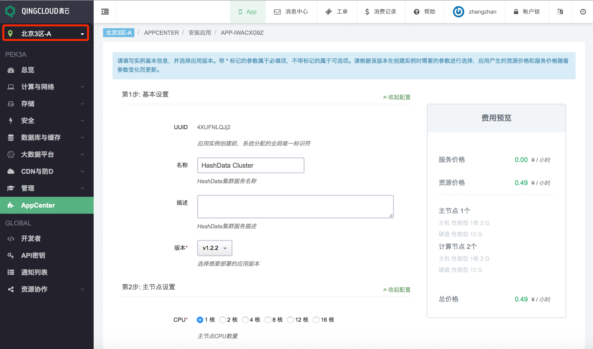
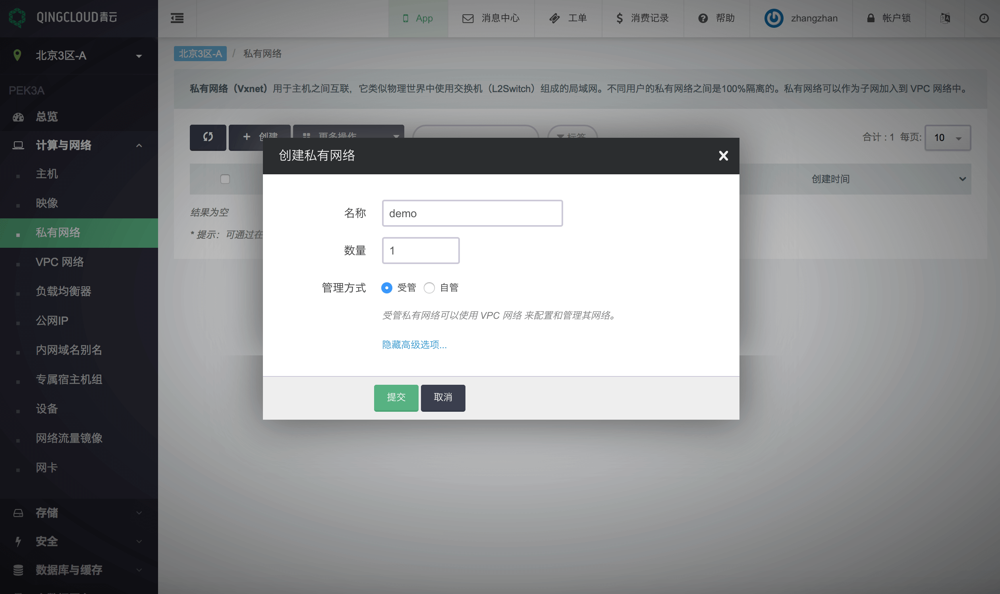
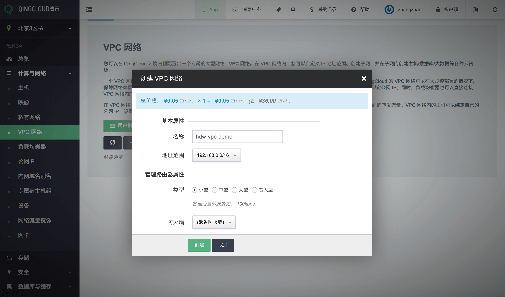
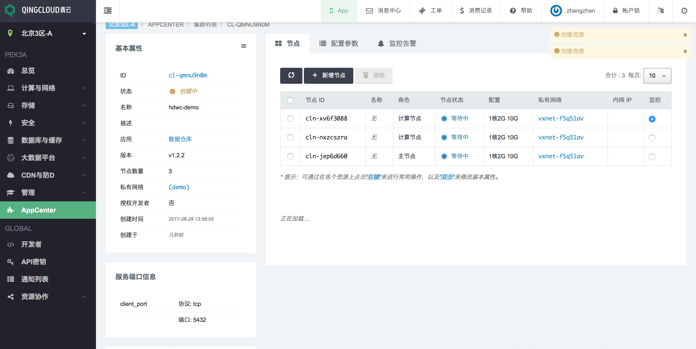
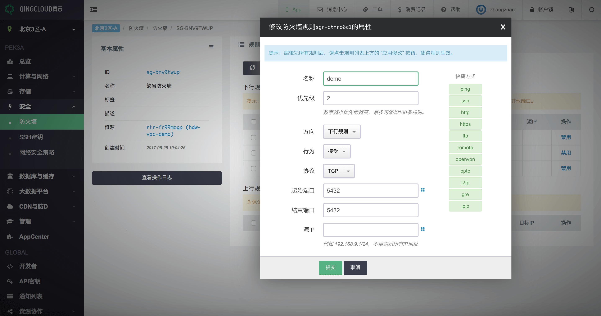
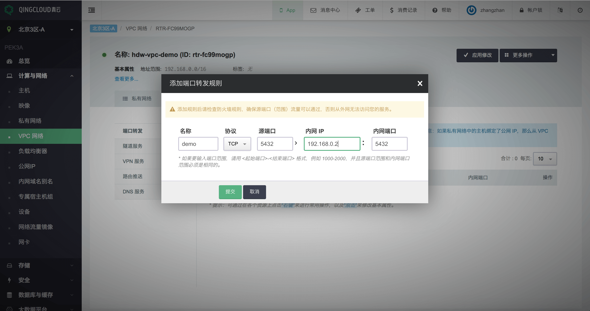
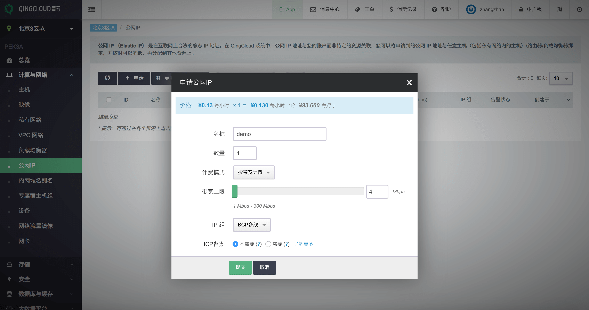
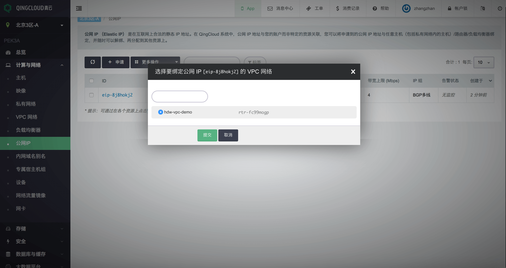

# 入门指南

## HashData 数据仓库入门指南

欢迎来到 HashData 数据仓库指南。HashData 数据仓库是一个高性能，完全托管的PB级数据仓库服务。一个 HashData 数据仓库是由一组称之为节点的计算资源组成的集群。每个集群作为一个 HashData 数据仓库引擎，包含一个或多个数据库。

这个指南的目的是指导你如何创建一个 HashData 数据仓库 样例集群。你可以通过这个样例集群来测试 HashData 数据仓库的功能。在这个教程中，你将执行如下步骤：

* 步骤1：准备工作
* 步骤2：启动 HashData 数据仓库样例集群
* 步骤3：授权连接样例集群
* 步骤4：连接样例集群
* 步骤5：将样例数据从对象存储加载到 HashData 数据仓库中
* 步骤6：寻找额外的资料和重设你的环境

这个教程的目的不是为了配置生产环境的，所以不会深入地讨论操作中的各种选项。当你完成了这个教程的所有步骤后，你能通过“额外的资料”章节找到关于集群计划、部署和维护，以及如何操作数据仓库中数据更深入的信息。

## 步骤1: 准备工作

在你创建第一个 HashData 数据仓库集群前，确保在这个章节中完成如下准备工作：

* 注册青云账号
* 安装 SQL 客户端工具
* 确认防火墙规则

### 注册青云账号

你首先需要注册一个青云账号，如果还没有的话。如果你已经拥有了一个青云账号，那么你可以使用这个账号进行接下来的操作，跳过这个步骤。

1. 打开链接 [http://qingcloud.com](http://qingcloud.com)，点击注册。
2. 按照页面提示完成注册流程。

### 安装 SQL 客户端工具

你可以使用任何 postgres 兼容的客户端程序连接到 HashData 数据仓库，比如 psql 。此外，你还可以通过绝大部分使用标准数据库应用接口，如 JDBC，ODBC 的客户端程序连接到 HashData 数据仓库。最后，你还可以使用标准数据库应用接口开发自己的客户端程序来访问 HashData 数据仓库。由于 HashData 数据仓库 基于 greenplum，而后者又是基于 postgres 而来，所以你可以直接使用 postgres 驱动访问 HashData 数据仓库。在这个教程中，我们将通过 psql 这个 postgres 的客户端程序演示如何连接到 HashData 数据仓库。

#### 安装 psql

1. 如果你正在使用 Linux 操作系统，你可以使用以下命令安装 psql 。

   ```
   Redhat/Centos:
   # yum install postgresql

   Ubuntu:
   # apt-get install postgresql-client
   ```

2. 或者访问 [PostgreSQL 官方网站](http://postgresql.org)，根据你的操作系统下载安装包。

### 确认网络配置

HashData 数据仓库使用 5432 作为服务的端口地址。 当你希望从云的外部访问 HashData 数据仓库服务时，你不仅需要拥有一个公网 IP 地址， 还需要指定一个绑定在公网 IP 地址上的端口，并将此端口转发到 HashData 数据仓库 的服务端口 5432 上。我们在随后的章节中帮助你完成端口转发的工作，现在你只需要明确这个端口的地址即可。 你可以随意指定这个端口， 为了便于记忆，我们推荐你仍然使用 5432 作为公网端口地址。

此外，你需要在青云防火墙中添加一个下行规则从而允许外来连接通过这个端口访问你的数据仓库集群。

如果你的客户端程序运行在云的内部，那么你既不需要进行端口转发，也不需要配置任何防火墙规则。

## 步骤2: 启动 HashData 数据仓库样例集群

完成上面的前提步骤后，现在你能够开始启动一个 HashData 数据仓库集群。

### 启动 HashData 数据仓库集群

1. 登陆青云并在应用中心找到对应的产品 [数据仓库(HashData高性能MPP数据仓库)](https://appcenter.qingcloud.com/apps/app-iwacxg9z)。
2. 点击部署到控制台，你可以选择在哪个数据中心创建你的数据仓库集群。在这个教程中，我们选择了北京 3 区。

   > 

3. 创建依赖资源：你需要有一个已连接到 VPC 的私有网络。如果您没有创建好依赖资源，点击创建后，可以按照提示完成下面的步骤：

   > * 创建私有网络：计算机与网络 -> 私有网络，点击创建
   >
   >   > 
   >
   > * 创建 VPC 网络：计算机与网络 -> VPC网络，点击创建
   >
   >   > 
   >
   > * 连接私有网络到 VPC 网络：计算机与网络 -> VPC网络，点击创建完成的VPC网络，将上面创建完成的私有网络添加到VPC中
   >
   >   > 

4. 创建好私有网络后，就可以创建 HashData 数据仓库集群了：

   > * 填写基本配置，选择软件版本
   > * 选择主节点的配置
   >
   >   > 
   >
   > * 选择计算节点的配置和数量
   >
   >   > 
   >
   > * 选择之前创建的私有网络
   >
   > * 设置数据库用户名，数据库密码以及初始数据库名字
   >
   > * 阅读用户协议
   >
   >   > 

5. 配置完以上参数，阅读并勾取用户协议，点击创建后，新的集群将会在几分钟之内创建完毕。下图是系统创建时的状态：

   > 

6. 在 AppCenter 控制面板中，选择新创建的集群并且查看集群状态信息。在你连接数据仓库之前，一定要确认集群的状态是可用的，并且数据库的健康状态是正常。

   > 

## 步骤3: 授权连接样例集群

在前面的步骤中，你已经创建启动了你的 HashData 数据仓库集群。在你连接到数据仓库集群之前，你需要对上一步骤中创建的路由器进行相应的配置。

### 防火墙配置

在路由器的详情页面，点击选用的防火墙进入其详情页面，添加一条打开 5432 端口的下行规则，如下所示：



这条下行规则允许你的 SQL 客户端工具能够访问路由器的 5432 端口。

### 路由器端口转发规则

回到路由器的详情页面，点击端口转发标签，添加一条 5432 端口的转发规则，如下所示：



这条转发规则确保在你访问路由器 5432 端口时，请求转发到 HashData 数据仓库集群的主节点 5432 端口。

### 配置公网 IP 

如果你的 SQL 客户端不在青云的网络里，你还需要申请一个公网 IP 地址，并绑定到前面步骤中创建的路由器。



将公网 IP 绑定到路由器：



## 步骤4: 连接样例集群

现在你可以通过 SQL 客户端工具连接到你的数据仓库集群，并且跑一条简单的查询语句来测试连接。你能够使用几乎所有与 postgres 兼容的 SQL 客户端工具。在这个教程中，你将使用在准备工作中安装的 postgres 自带的 psql 客户端。

### 确定连接IP地址和端口

数据仓库集群的IP地址可由配置公网 IP 步骤中确定。在剩下的教程中，我们用 121.201.25.29 作为例子。在集群主控制台，选择 examplecluster 进入详情页面。从详情页面中，你能看到端口：5432。

### 使用 psql 连接到集群

你可以通过下面命令连接到集群：

```
psql -d postgres -h 121.201.25.29 -p 5432 -U admin
```

然后根据提示输入登陆密码。

### 简单测试查询

登陆数据仓库后，你可以运行如下命令做一些简单的测试查询：

```
postgres=# CREATE TABLE foo (a INT, b INT);  
NOTICE:  Table doesn't have 'DISTRIBUTED BY' clause -- Using column named 'a' as the Greenplum Database data distribution key for this table.  
HINT:  The 'DISTRIBUTED BY' clause determines the distribution of data. Make sure column(s) chosen are the optimal data distribution key to minimize skew.  
CREATE TABLE  
postgres=# INSERT INTO foo (SELECT i, i + 1 FROM generate_series(1, 10000) AS i);  
INSERT 0 10000  
postgres=# SELECT COUNT(*) FROM foo;

## count

10000  
(1 row)

postgres=# SELECT SUM(a) FROM foo;

## sum

50005000  
(1 row)
```

## 步骤5: 将样例数据从对象存储加载到 HashData 数据仓库中


现在你已经有了一个名为 postgres 的数据库，并且你已经成功地连接上它了。接下来你可以在数据库中创建一些新表，然后加载数据到这些表中，并尝试一些查询语句。为了方便你的测试，我们准备了一些TPC-H的样例数据存储在青云对象存储中。

1.  创建表

    拷贝并执行下面的建表语句在 postgres 数据库中创建相应的表对象。你可以通过 HashData 数据仓库 [开发者指南](http://www.hashdata.cn/docs/developer-guide/welcome.html) 查看更详细的建表语法。

    其中定义的外部表（READABLE EXTERNAL TABLE）用来访问青云对象存储上面的数据。我们提供了 TPC-H 1GB、10GB、100GB 的公共测试数据集，在此示例中我们使用 1GB 的 TPCH 数据集。

```
    CREATE TABLE NATION  ( 
        N_NATIONKEY  INTEGER NOT NULL,
        N_NAME       CHAR(25) NOT NULL,
        N_REGIONKEY  INTEGER NOT NULL,
        N_COMMENT    VARCHAR(152));

    CREATE TABLE REGION  ( 
        R_REGIONKEY  INTEGER NOT NULL,
        R_NAME       CHAR(25) NOT NULL,
        R_COMMENT    VARCHAR(152));

    CREATE TABLE PART  ( 
        P_PARTKEY     INTEGER NOT NULL,
        P_NAME        VARCHAR(55) NOT NULL,
        P_MFGR        CHAR(25) NOT NULL,
        P_BRAND       CHAR(10) NOT NULL,
        P_TYPE        VARCHAR(25) NOT NULL,
        P_SIZE        INTEGER NOT NULL,
        P_CONTAINER   CHAR(10) NOT NULL,
        P_RETAILPRICE DECIMAL(15,2) NOT NULL,
        P_COMMENT     VARCHAR(23) NOT NULL );

    CREATE TABLE SUPPLIER ( 
        S_SUPPKEY     INTEGER NOT NULL,
        S_NAME        CHAR(25) NOT NULL,
        S_ADDRESS     VARCHAR(40) NOT NULL,
        S_NATIONKEY   INTEGER NOT NULL,
        S_PHONE       CHAR(15) NOT NULL,
        S_ACCTBAL     DECIMAL(15,2) NOT NULL,
        S_COMMENT     VARCHAR(101) NOT NULL);

    CREATE TABLE PARTSUPP ( 
        PS_PARTKEY     INTEGER NOT NULL,
        PS_SUPPKEY     INTEGER NOT NULL,
        PS_AVAILQTY    INTEGER NOT NULL,
        PS_SUPPLYCOST  DECIMAL(15,2)  NOT NULL,
        PS_COMMENT     VARCHAR(199) NOT NULL );

    CREATE TABLE CUSTOMER ( 
        C_CUSTKEY     INTEGER NOT NULL,
        C_NAME        VARCHAR(25) NOT NULL,
        C_ADDRESS     VARCHAR(40) NOT NULL,
        C_NATIONKEY   INTEGER NOT NULL,
        C_PHONE       CHAR(15) NOT NULL,
        C_ACCTBAL     DECIMAL(15,2)   NOT NULL,
        C_MKTSEGMENT  CHAR(10) NOT NULL,
        C_COMMENT     VARCHAR(117) NOT NULL);

    CREATE TABLE ORDERS (
        O_ORDERKEY       INT8 NOT NULL,
        O_CUSTKEY        INTEGER NOT NULL,
        O_ORDERSTATUS    CHAR(1) NOT NULL,
        O_TOTALPRICE     DECIMAL(15,2) NOT NULL,
        O_ORDERDATE      DATE NOT NULL,
        O_ORDERPRIORITY  CHAR(15) NOT NULL,
        O_CLERK          CHAR(15) NOT NULL,
        O_SHIPPRIORITY   INTEGER NOT NULL,
        O_COMMENT        VARCHAR(79) NOT NULL);

    CREATE TABLE LINEITEM ( 
        L_ORDERKEY    INT8 NOT NULL,
        L_PARTKEY     INTEGER NOT NULL,
        L_SUPPKEY     INTEGER NOT NULL,
        L_LINENUMBER  INTEGER NOT NULL,
        L_QUANTITY    DECIMAL(15,2) NOT NULL,
        L_EXTENDEDPRICE  DECIMAL(15,2) NOT NULL,
        L_DISCOUNT    DECIMAL(15,2) NOT NULL,
        L_TAX         DECIMAL(15,2) NOT NULL,
        L_RETURNFLAG  CHAR(1) NOT NULL,
        L_LINESTATUS  CHAR(1) NOT NULL,
        L_SHIPDATE    DATE NOT NULL,
        L_COMMITDATE  DATE NOT NULL,
        L_RECEIPTDATE DATE NOT NULL,
        L_SHIPINSTRUCT CHAR(25) NOT NULL,
        L_SHIPMODE     CHAR(10) NOT NULL,
        L_COMMENT      VARCHAR(44) NOT NULL);

    CREATE READABLE EXTERNAL TABLE e_NATION (LIKE NATION)
    LOCATION ('qs://hashdata-public.pek3a.qingstor.com/tpch/1g/nation/') FORMAT 'csv';

    CREATE READABLE EXTERNAL TABLE e_REGION (LIKE REGION)
    LOCATION ('qs://hashdata-public.pek3a.qingstor.com/tpch/1g/region/') FORMAT 'csv';

    CREATE READABLE EXTERNAL TABLE e_PART (LIKE PART)
    LOCATION ('qs://hashdata-public.pek3a.qingstor.com/tpch/1g/part/') FORMAT 'csv';

    CREATE READABLE EXTERNAL TABLE e_SUPPLIER (LIKE SUPPLIER)
    LOCATION ('qs://hashdata-public.pek3a.qingstor.com/tpch/1g/supplier/') FORMAT 'csv';

    CREATE READABLE EXTERNAL TABLE e_PARTSUPP (LIKE PARTSUPP)
    LOCATION ('qs://hashdata-public.pek3a.qingstor.com/tpch/1g/partsupp/') FORMAT 'csv';

    CREATE READABLE EXTERNAL TABLE e_CUSTOMER (LIKE CUSTOMER)
    LOCATION ('qs://hashdata-public.pek3a.qingstor.com/tpch/1g/customer/') FORMAT 'csv';

    CREATE READABLE EXTERNAL TABLE e_ORDERS (LIKE ORDERS)
    LOCATION ('qs://hashdata-public.pek3a.qingstor.com/tpch/1g/orders/') FORMAT 'csv';

    CREATE READABLE EXTERNAL TABLE e_LINEITEM (LIKE LINEITEM)
    LOCATION ('qs://hashdata-public.pek3a.qingstor.com/tpch/1g/lineitem/') FORMAT 'csv';
```

1. 执行如下命令将保存在对象存储上面的 TPC-H 数据拷贝插入到数据仓库表中。

```
INSERT INTO NATION SELECT * FROM e_NATION;  
INSERT INTO REGION SELECT * FROM e_REGION;  
INSERT INTO PART SELECT * FROM e_PART;  
INSERT INTO SUPPLIER SELECT * FROM e_SUPPLIER;  
INSERT INTO PARTSUPP SELECT * FROM e_PARTSUPP;  
INSERT INTO CUSTOMER SELECT * FROM e_CUSTOMER;  
INSERT INTO ORDERS SELECT * FROM e_ORDERS;  
INSERT INTO LINEITEM SELECT * FROM e_LINEITEM;
```

1. 现在可以开始运行样例查询了。

   这里所采用的数据集和查询是商业智能计算测试 TPC-H。TPC-H 是美国交易处理效益委员会组织制定的用来模拟决策支持类应用的一个测试集。TPC-H 实现了一个数据仓库，共包含8个基本表，其数据量可以设定从 1G 到 3T 不等。在这个样例中，我们选择了 1G 的数据集。TPC-H 基准测试包括 22 个查询，其主要评价指标是各个查询的响应时间，即从提交查询到结果返回所需时间。这里只提供了前三条查询语句。关于 TPC-H 完整 22 条查询语句以及详细介绍可参考 [TPC-H 主页](http://www.tpc.org/tpch/)。

```
-- This query reports the amount of business that was billed, shipped, and returned.

select  
       l_returnflag,  
       l_linestatus,  
       sum(l_quantity) as sum_qty,  
       sum(l_extendedprice) as sum_base_price,  
       sum(l_extendedprice * (1 - l_discount)) as sum_disc_price,  
       sum(l_extendedprice * (1 - l_discount) * (1 + l_tax)) as sum_charge,  
       avg(l_quantity) as avg_qty,  
       avg(l_extendedprice) as avg_price,  
       avg(l_discount) as avg_disc,  
       count(*) as count_order  
   from  
       lineitem

where  
       l_shipdate <=  '1998-12-01'  
   group by  
       l_returnflag,  
       l_linestatus  
   order by  
       l_returnflag,  
       l_linestatus;

-- This query finds which supplier should be selected to place an order for a given part in a given region.

select  
       s.s_acctbal,  
       s.s_name,  
       n.n_name,  
       p.p_partkey,  
       p.p_mfgr,  
       s.s_address,  
       s.s_phone,  
       s.s_comment  
   from  
       supplier s,  
       partsupp ps,  
       nation n,  
       region r,  
       part p,  
       (select p_partkey, min(ps_supplycost) as min_ps_cost  
               from  
                       part,  
                       partsupp ,  
                       supplier,  
                       nation,  
                       region  
               where  
                       p_partkey=ps_partkey  
                       and s_suppkey = ps_suppkey  
                       and s_nationkey = n_nationkey  
                       and n_regionkey = r_regionkey  
                       and r_name = 'EUROPE'  
               group by p_partkey ) g  
   where  
       p.p_partkey = ps.ps_partkey  
       and g.p_partkey = p.p_partkey  
       and g. min_ps_cost = ps.ps_supplycost  
       and s.s_suppkey = ps.ps_suppkey  
       and p.p_size = 45  
       and p.p_type like '%NICKEL'  
       and s.s_nationkey = n.n_nationkey  
       and n.n_regionkey = r.r_regionkey  
       and r.r_name = 'EUROPE'  
   order by  
       s.s_acctbal desc,  
       n.n_name,  
       s.s_name,  
       p.p_partkey  
   LIMIT 100;

-- This query retrieves the 10 unshipped orders with the highest value.

select  
       l_orderkey,  
       sum(l_extendedprice * (1 - l_discount)) as revenue,  
       o_orderdate,  
       o_shippriority  
   from  
       customer,  
       orders,  
       lineitem  
   where  
       c_mktsegment = 'MACHINERY'  
       and c_custkey = o_custkey  
       and l_orderkey = o_orderkey  
       and o_orderdate < '1995-03-15'  
       and l_shipdate >  '1995-03-15'  
   group by  
       l_orderkey,  
       o_orderdate,  
       o_shippriority  
   order by  
       revenue desc,  
       o_orderdate  
   LIMIT 10;  
```

## 步骤6: 寻找额外的资料和重设你的环境

完成这个入门教程后，你可以寻找更多额外的资料来学习和理解这个教程中介绍的概念，或者你可以将你的环境重置回原来的状态。如果你想尝试其他学习资料中提到的任务，你可以让集群一直运行着。不过，需要注意的是，只要集群还运行着，你将一直被收取费用。

### 额外学习资料

我们建议您可以通过如下资料来学习和理解这个教程中介绍的概念：

* HashData 数据仓库 [集群管理指南](http://www.hashdata.cn/docs/cluster-management-guide/cluster-management-guide.html)
* HashData 数据仓库 [数据库开发者指南](http://www.hashdata.cn/docs/developer-guide/welcome.html)

### 重置你的环境

当你完成了这个入门指南，你可以通过如下步骤重置你的环境：

* 删除步骤 3 中添加的防火墙规则和路由器转发规则。
* 删除样例集群。


